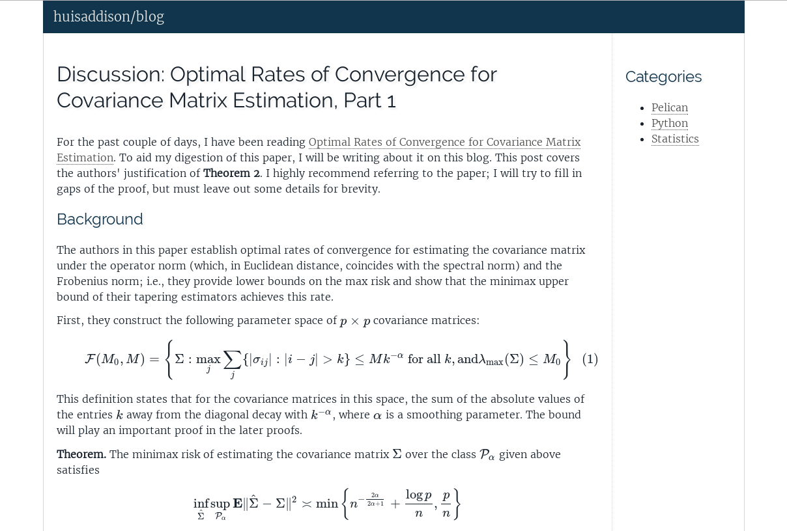

# blog-theme
Simple theme for my blog (powered by Pelican).

The theme is heavily derived from
[pelican-simplegrey](https://github.com/fle/pelican-simplegrey).  The only
changes I have made are:
* Change greys to blues
* Tune the fonts to my preferences
* Update the footer in `base.html` to reflect the current year and my heavy
  reliance on [MathJax](https://www.mathjax.org/).
* Fix `article_link.inc.html` so that tags are delimited by commas (strange
  that this was an oversight in the original theme as the tags are delimited
  properly in `metadata.inc.html`.

More features will be added as the need arises.

