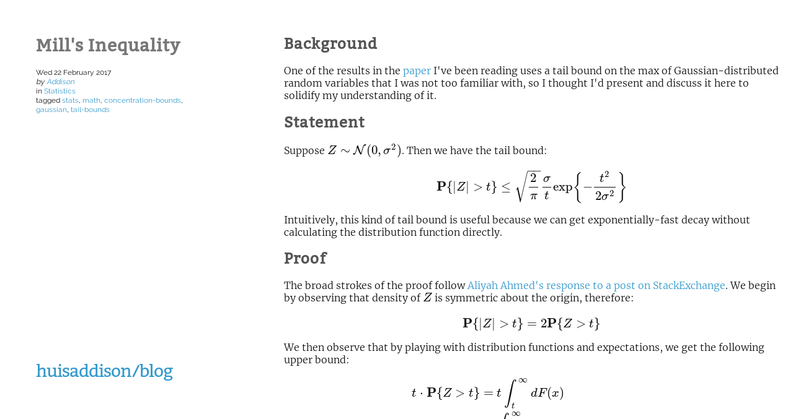

# blog-theme
Simple theme for my [blog](http://huisaddison.com/blog) (powered by Pelican).

The theme is heavily derived from
[pelican-simplegrey](https://github.com/fle/pelican-simplegrey).  The only
changes I have made are:
* Change greys to blues
* Tune the fonts to my preferences
* Update the footer in `base.html` to reflect the current year and my heavy
  reliance on [MathJax](https://www.mathjax.org/).
* Fix `article_link.inc.html` so that tags are delimited by commas (strange
  that this was an oversight in the original theme as the tags are delimited
  properly in `metadata.inc.html`.
* Tune the 'huisaddison/blog' header to link to my base website and the blog,
  respectively.
* Insert the current year in the footer dynamically using datetime.
* Grab jinja vars (?) for home site url, blog source, etc. from pelicanconf.

More features will be added as the need arises.  Currently on my todo list:
* Revamp `index.html` so it only shows a fixed amount of content from the
  most recent post; and possibly show more than the most recent post

